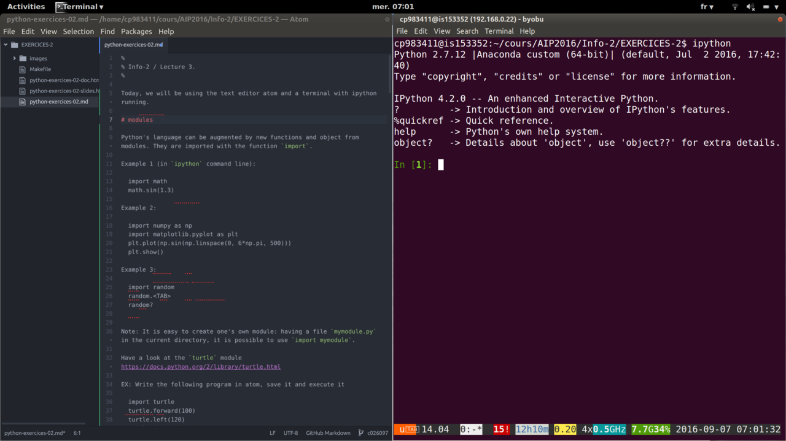

%
% Info-2 / Lecture 3.
%

Today, we will be using the text editor atom and a terminal with ipython running.



# modules

Python's language can be augmented by new functions and object from ***modules*** (or ***packages***, or ***libraries***). They are imported with the function `import`.

Example 1 (in `ipython` command line):

```python
import math
math.sin(1.3)
```

. . .

Example 2:

```python
import numpy as np
import matplotlib.pyplot as plt
plt.plot(np.sin(np.linspace(0, 6*np.pi, 500)))
plt.show()
```

. . .

Example 3:

```python
import random
random.<TAB>
random?
```


# Standard modules and more

* Python comes with a standard library of modules:
	https://docs.python.org/2/library/index.html

* Anaconda comes with more libraries pre installed: https://docs.continuum.io/anaconda/pkg-docs

* It is easy to create one's own module: having a file `mymodule.py` in the current directoy, it is possible to use `import mymodule`.


# Playing with the turtle
Have a look at the `turtle` module https://docs.python.org/2/library/turtle.html

EX: Write the following program in atom, save it and execute it

```python
	import turtle
	turtle.forward(100)
	turte.left(120)
	turtle.forward(100)
	turtle.left(120)
	turtle.forward(100)
	turtle.left(120)
	turtle.mainloop()
```

EX: Modify this program to display a regular polygon with `n` sides


# Prime numbers

Given the following function:

```python
def is_factor(a, b):
	return b % a == 0

print(is_factor(3, 27))
print(is_factor(3, 28))
```

Write a program that determines prime numbers between 1 and 100

. . .

# Back to automata

1. Write a program that simulates the following automaton:


The input is a list a coins, e.g.,  'dime', 'quarter', 'nickel' and the program must write 'ok' if the sequence leads to the correct amount (25 cents).

. . .

2. Write a program that recognizes if a character string conforms to the pattern HA!, HAHA!, HAHAHA!, ...

. . .

# Representing number in binary

Remember that a number represented by four digits "d3 d2 d1 d0" in a basis 'b', has a value of d3*b^3 + d2*b^2 + d1*b^1 + d0*b^0

- In binary, there are only two possibilities for the digits: {0,1}
- In decimal, 10 possible characters
- In hexadecimal, 16 possible characters 0-9, A, B, C, D, E, F
(D8F1 = 14*16^3 + 8*10^2 + 15*16^1 + 1*16^0)

To learn more about how integer numbers are represented in binary format, you can check out <http://csunplugged.org/binary-numbers>

Convert (manually) into decimal the following binary numbers:
- 101
- 1000
- 1011
- 11111111

. . .

*Answer:* 5, 8, 11, 255

## From  binary to decimal


Let us write a function that, given the binary representation of a number as a string of '0' and '1', returns its value as a integer.


1. Let us first suppose that we want to convert a string containing exactly 8 binary digits (e.g. '01011010') into decimal. How would you do that?

. . .


Here is a proposal:

```python
def todec8bits(s):
	return int(s[0])*128 + int(s[1])*64 + int(s[2])*32 + \
	       int(s[3])*16 + int(s[4])*8 + int(s[5])*4 + \
		   int(s[6])*2 + int(s[7])

todec8bits("01010101")
```

And another solution which demonstrates several Pythonic constructions that we have not seen yet:

```python
pow2 = [2 ** n for n in range(7, -1, -1)]
n = 0
for b, p in zip(s, pow2):
	n += int(b) * p
print(n)
```
. . .

The previous codes had an issue: they only worked for 8bits numbers:

```python
todec8bits("0101010")
todec8bits("010101010")
```

We should modify it to adapt to the size of the string 's'.

Can you try?
. . .

Here is a possible solution:

```python
def todec(s):
	""" convert a string of 0 and 1 representing a binary number into an integer """
	n = 0
	for b in s:
		n = n * 2 + int(b)
	return n

for i in ['101', '1000', '1011', '11111111']:
	print(todec(i))
```

------------------------

## From decimal to binary

Now we will go in the other direction: Our aim is to write a program that, given a number (in decimal), computes its binary representation.

If you have an idea how to program it, please proceed. If not, we propose that you follow the following steps:

Study the program below.  Execute it with various values of the variable *num*. Do you understand the last line? Do you see a limitation of this program?

```python
num = 143
d3 = int(num/1000) % 10 # thousands
d2 = int(num/100)  % 10 # hundreds
d1 = int(num/10)   % 10 # dec
d0 =  num % 10
print(str(d3) + str(d2) + str(d1) + str(d0))
```

(@) Adapt the above program to print the binary representation of num

. . .

```python
num = 17
b0 = num % 2
b1 = int(num/2) % 2
b2 = int(num/4) % 2
b3 = int(num/8) % 2
b4 = int(num/16)  % 2
b5 = int(num/32)  % 2
b6 = int(num/64)  % 2
b7 = int(num/128) % 2
b8 = int(num/256) % 2
print(str(b8) + str(b7) +  str(b6) + str(b5) + str(b4) + str(b3) + str(b2) + str(b1) + str(b0))
```


. . .

(@) Modify the above program to print the binary representations of every number between 0 and 255.

. . .

```python
def tobin(num):
	b7 = int(num/128) % 2
	b6 = int(num/64)  % 2
	b5 = int(num/32)  % 2
	b4 = int(num/16)  % 2
	b3 = int(num/8) % 2
	b2 = int(num/4) % 2
	b1 = int(num/2) % 2
	b0 = num % 2
    return (str(b7) +  str(b6) + str(b5) + str(b4) + \
	        str(b3) + str(b2) + str(b1) + str(b0))

for n in range(256):
	print(n, tobin(n))

```

. . .

(Advanced) Write an improved version that uses a loop and does not have a limitation in size.

. . .

```python
def binary(n):
	if n==0:
		return "0"
	s = ""
	while n > 0:
		b = str(n % 2)
		s = b + s
		n = n / 2
	return s
```

. . .

Study the following code. Do you understand why it works?

```python
def binary(num):
	if num == 0:
		return "0"
	if num == 1:
		return "1"
	return(binary(int(num /2)) + binary(num % 2))

print(binary(1234))
```

. . .

*Answer:*
It is a recursive function which calls itself. See <http://en.wikipedia.org/wiki/Recursion_%28computer_science%29>

. . .


A bit more about recursion:

The factorial of a integer number 'n' is the function that associate to n the product of 1, 2, ..., n. Therefore f(n) = f(n-1) * n

Write a recursive function that computes factorial(n)

. . .

The Fibonacci sequence is such that:

u_0 = 1
u_1 = 1
u_n = u_{n-1} + u_{n-2}

Program a function that returns the 'n'th Fibonacci number.

. . .

To go further:

* If you want to know how negative integer numbers are represented, see <http://en.wikipedia.org/wiki/Two%27s_complement>

* Type `0.1 + 0.3`
 in the python console and be amazed. To understand what is going on, read
[python's doc about floats] (https://docs.python.org/2/tutorial/floatingpoint.htmlhttps://docs.python.org/2/tutorial/floatingpoint.html) and [What Every Programmer Should Know About Floating-Point Arithmetic](http://floating-point-gui.de/).


# Representation of text

A text file is nothing but a sequences of characters.

For a long time, characters were encoded using ASCII code.


In Python, you can know the code of a character with the function `ord`:

    print(ord('a'))
    print(ord('@'))

The inverse of `ord` is `chr`.

(@) lookup the ASCII representation of  your first name in the table and use the `chr` function of Python to print it.

. . .

For example, if you name is 'ZOE', you would type:

    print(chr(90)+chr(79)+chr(69))


Remark: **ASCII** codes use one byte (=8bits) per character. This is fine for English, but cannot cover all the caracters of all alphabets. It cannot even encode french accented letters.

**Unicode** was invented that associate a unique 2 bytes number to each character of any human script. It is possible to write text files using these number, but more economic to encode the most common letters with one byte, and keep the compatibility with ASCII (UTF-8).


    print("".join([unichr(c) for c in range(20000, 21000)])))


# A few useful functions on strings

```python
a = "Bonjour Jean"
len(a)
a[2:4]

a.replace("Jean", "Marc")
a
b = a.replace("Jean", "Marc")

a = "caillou, genou, bijou"
a.split(",")

b= ['alpha', 'beta', 'gamma']
";".join(b)
```

# lists and dictionaries

```python
mylist1 = ['alpha', 'beta', 'gamma']
mylist2 = [1, 2, 3]
for i in range(len(list1)):
	print(mylist1[i], mylist2[i])
```

Note: remember `zip`?

```python
mydict = { 'alpha':1, 'beta':2, 'gamma':3}
for i, v in mydict:
	print i, v
```

You can think of dictionaries as functions from keys to values.

. . .

EX: Given a list of words, write a program that find which are anagrams


# Reading and writing files

Create a file containing a few lines of text with atom and save it under the name `myfile.txt`.

Execute the code:

```python
inputFile = file(‘myfile.txt’)
for lines in inputFile:
	print lines
```
. . .

Write a function `count-words` that counts the number of words in myfile.txt

. . .

Remark: with the module `sys`, you can read argument on the command line.

```python
import sys
fname = sys.argv[1]
print(count_words(fname))
```


Read the file  http://pallier.org/ressources/AIP2016/Info-2/EXERCICES-2/american-english.txthttp://pallier.org/ressources/AIP2016/Info-2/EXERCICES-2/american-english.txt
using the function `urllib2.urlopen`

EX: Find all anagrams in English
